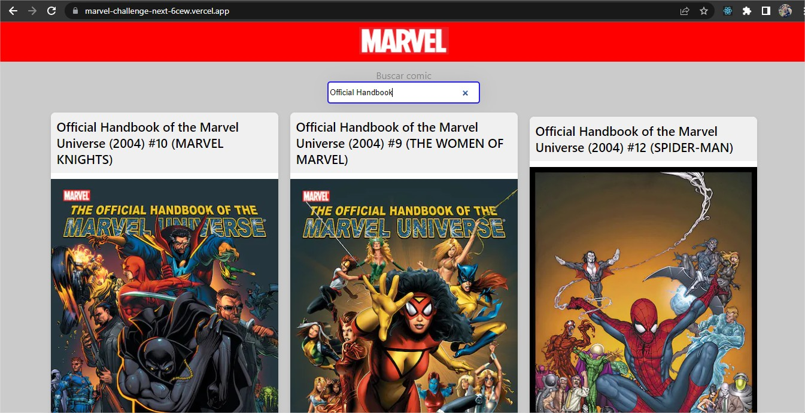
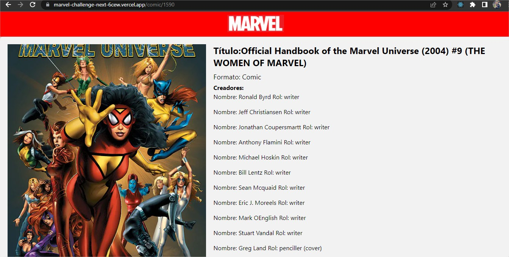

## Getting Started

npm install,
npm run dev
Link de deploy: https://marvel-challenge-next-6cew.vercel.app

Para este proyecto se utilizó la última versión de Next.js, aún así, sólo se implementó lo justo y necesario.

Teniendo en cuenta el PDF de requermientos, se optó por seguir una línea de resolución, dejando de lado otras opciones para complementar el código que se nombran más adelante.

Pensamiento lógico:
He de decir que proyectos similar a éste ya los he realizado en el pasado. 
Lo curioso fue darme cuenta desde el inicio que ya sabía lo que debía hacer, y con ello pasé a elegir la opción más conveniente, considerando escalabilidad y legibilidad.

Por un lado, utilizando algo como Next.js lograba un desarrollo rápido, pero por otro, si usaba Vite + manejo de estados globables con useContext + useReducer, podía tener un manejo de estado y compararlo con Angular.

En ambos casos, lo principal era decidir desde el principio qué hacer, así que opté por definir las constantes, crear un hook para los métodos Http, aunque en este proyecto finalmente opté por 1 fetch del lado del navegador y otro del lado del servidor, para mostrar ambos conocimientos. 

Tras ello, pasé a definir los componentes principales que iba a necesitar, y considerando que fuera una webApp más seria, también necesitaría algo de SEO, por lo cual creé un componente para ello.

Y por último, pasé a implementar la lógica en las rutas e ir haciendo que funcione, tras lo cual iba importando y añadiendo datos a los componentes que fuera necesitando.

Uso de Angular, implica aprenderlo e implementarlo, corriendo el riesgo de trabarme con erorres. Para el día martes estaré evaluando si hacer igual un proyecto aparte en Angular o este mismo con TypeScript.

Obstáculos:
Primero se evaluó la API, con la cual me encontré lidiando 30min hasta darme cuenta que me faltaba un dato para generar el hash del apikey.

Luego, al realizar el detalle de cada comic, el redireccionamiento no funcionaba, pese a que ya había realizado el componente y la lógica, al final fue que estaba redireccionando a /id en vez de /comic/id, perdiendo unos 40min en ello.

Por último, a la hora del deploy, tuve que utilizar el componente Image de Next.js, del cual no soy partidario ya que considero que se puede tener soluciones igual de buenas con un desarrollo propio, y así no atarse a una plataforma/método de desarrollo, pero por cuestiones de velocidad debí hacerlo y configurarlo.

Fueron las únicas trabas -sacando de lado la limpieza de código para el deploy-, lo demás salió todo bien y lo fui haciendo tranquilo.

Si es por continuar sumando features y buenas prácticas, no he llegado a agregar Paginado, DarkMode, documentación con Storybook, un generador de variantes de estilos similar a Bootstrap, ni el controlador de errores con ErrorBoundary.